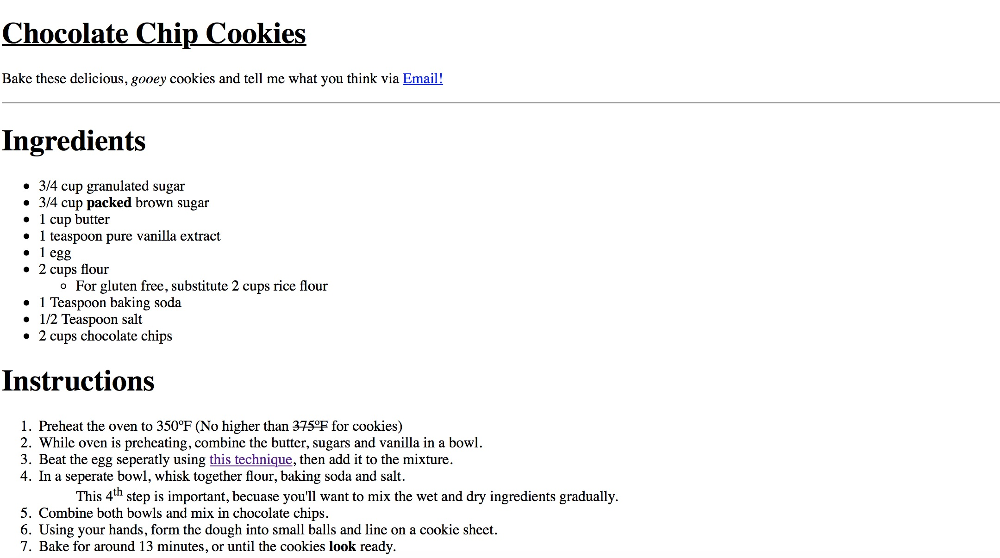

Katherine Cier
Nick Moles 50

# Summary:
This week I started off by reading Chapter 2 and 3 in the Duckett to view more information about techniques and elements to put into HTML.  I found it particularly helpful to have my recipe assignment open the entire time to work on it as I went through the elements and semantic markups.  I eventually added the elements to my recipe by adding them into the recipe I wrote out first. I found the Duckett to be very helful this unit because of the images. After working on my recipe, I used the preference on my computer to view the code on Facebook and Moodle, which was fairly interesting, and a bit over my head.  The most fun thing for me this week was using the WayBack machine to look at the website of the newspaper where I grew up: sltribune.com.  I pluuged in dates around 9/11 to see what sort of articles were being posted and which images were used.  I was surprised to find how little (especially the login page) has changed over time or since I got one in 2009- it seems like they added a bit more color.

## Homework:
Creating the recipe for this week went relatively smoothly, mostly because we worked on basic HTML last week. In fact, I overcame all of the problems I had last week with source tree and was able to commit everything smoothly.  The problems I faced this week were:
1.  Adding a link to my HTML file that would direct the user to another HTML file.
   * I had trouble with this because I wasn't sure where to save my new HTML file to, what code to use to get to it, or where to name it.
   * I posted on the issue board to see if anyone was having the same problem; I was clicking the link but it was bringing me to a blank page.
   * After looking through google solutions and those from stackoverflow.com, I found that I had done everything correctly but named my new file wrong so the computer wasn't able to locate it.  I changed the name from index.techniques.html to techniques.html, and because they were in the same directory, the computer new to put them on the same URL.

2.  I found some of the elements from the Duckett to not be helpful in creating a recipe.
    * I eventually was able to apply most of the elements (like the strikethrough and delete symbol) to the definition page.

## Going forward:
I learned that the Duckett is a very reliable source and it is helpful to keep it open while completing any assignments.  I also learned that other people have had a lot of the same problems as me, and the forum on stackoverflow.com is helpful. I still need to memorize some of the more basic HTML codes so I do not have to refer to the class page every time.

