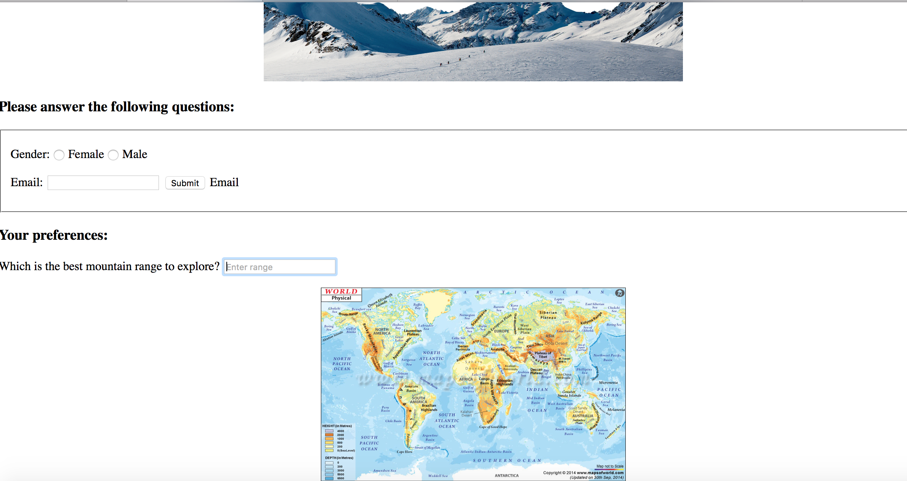
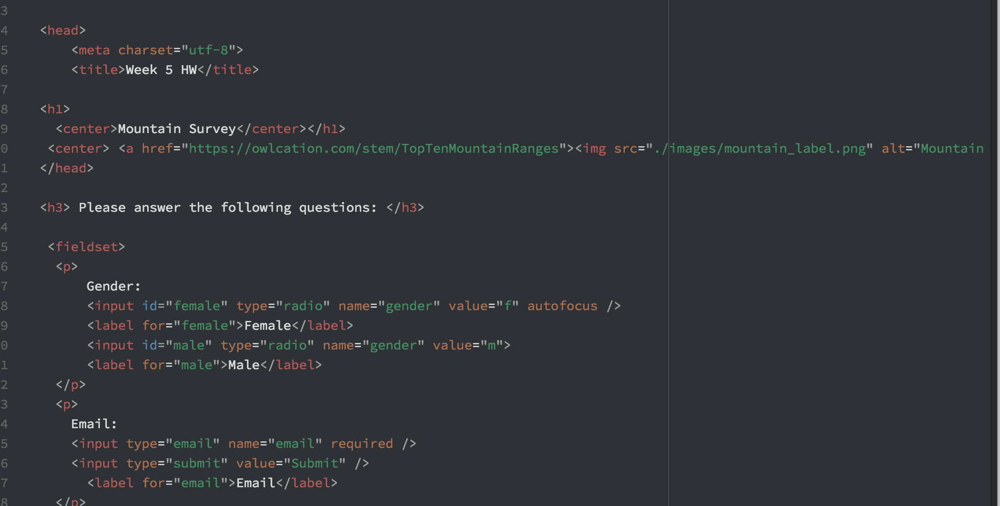

Kate Cier
Nick Moles 50

# Summary:
I found this week's work to be more fun because it required more creativity, especially with picking out images and placing them on the HTML file.  I am becomming very comfortable with ATOM and Github- as well as the homework repo.  I began by reading all of the homework instructions on the class page.
When it mentioned child directorys and images in relation to HTML, I posted on the class issue page because I had problems with that last week.
* I found that I was just not typing the correct thing in my html file- I didn't add the "./" then the main directory then the image.

I read through the rest of the class page and the Duckett which I left open to reference during my homework because teh pictures make it easier to follow.

## Homework:
I began my homework by picking out something that I'm interested for the survey: mountains.  I started by creating the ehader and grouping it with a .png image that I wanted to use to empahsize the heading. I linked this image to a refernce page of mountains.  Adding the elements was simple enough by following the instructions, but I was a little confused when it came to the 'label' element.
* After reading the instructions again, I found that the label element would only be present when scrolling over things and not visble in the actual HTML preview.

One of the most difficult things was coming up with questions that would fit the input elements. For example, writing out all the mountain ranges in order for a drop down menu was a bit tedious.  Another thing that I was frustrated with was how to images looked on HTML preview vs how they looked on the browser. I had them centered on my HTML file but decided to move them to the edge of the assignment.

 

 

 ### Going forward:

 I learned with this homework assignment that not every element is necessary to be able to read the file.  For example, it is good to include the fieldset element for some questions on the survey, overusing it can make it confusing to look at.  I also found that looking at the example on the homework wiki helped a lot in directing me to where I should but specific elements like "label" and "autofocus.'
