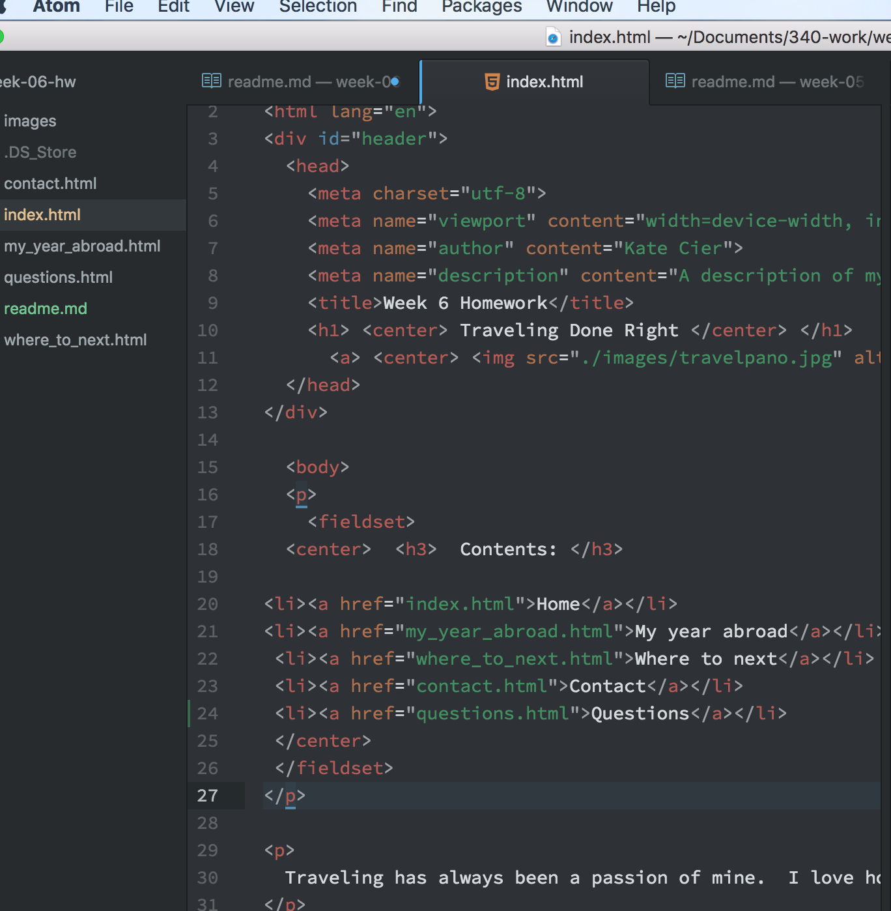
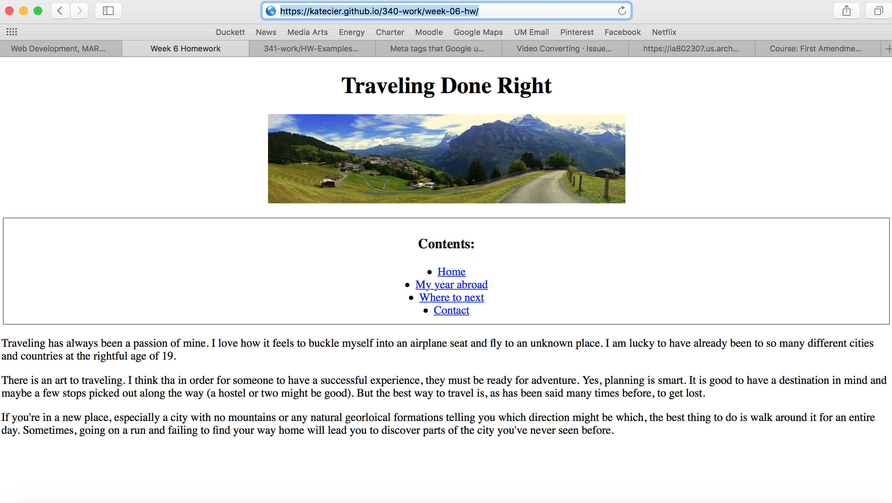

Kate Cier
Nick Moles 50

# Summary
This week I found to be a bit more difficult than past weeks.  This was probably because we had to include so many elements into one assignment which made looking at the Atom page more confusing.  I found that the meta element makes the text edit document more cluttered, even though it has a useful cause.

The textbook did a good job explaining why the meta tags were used and the website we were assigned to look at gave really good examples that I tested by copying and pasting into my file. During the course of the week, any issues I had were easily solved by referring to the textbook- mostly me just forgetting basic elements or structure.  I participated in the issue conversation by answering someone's question about downloading or converting a video.  I told her that for my homework, I downloaded a stock video off a stock website which made the process simple because it was a .mov file without a copyright.

## Homework
The homework was very time consuming only because there were so many pages and I had to keep everything very organized to make sure each page linked to each other and all elements were there.
* One problem I had was forgetting to save the atom file so I was not able to see changes online.
Once I realized that the meta elemetns such as 'author' are the keywords that appear in a google search, I gained more undertadning of the point of the elemtns overall and where I should apply them.  I put most of them only in the homepage figuring that people would search for then and then people able to click the relative links and go from there.
  

As for uploading videos, I really did not have any trouble except making the video the right size.  The first one I embeded off of vimeo was huge, so I simply changed the dimesions.

I am still having trouble making the photos the right dimesions so they fit the screen in the web browser- not the Atom screen.
  

## Take away
I've learned that I really enjoy the design element of these assignments and find it fun to make my html pages aethetically pleasing.  I am not sure if more HTML coding will lead to more of this or if there are other programs that will let me do more of it.

Multimedia is so important these days and I'm glad I now have the ability to both make videos and post them online. This would be good for resume building on a website.

The review at the end of the lesson was very helpful because I'd forgotten small things which is the hardest part of writing HTML for me.
