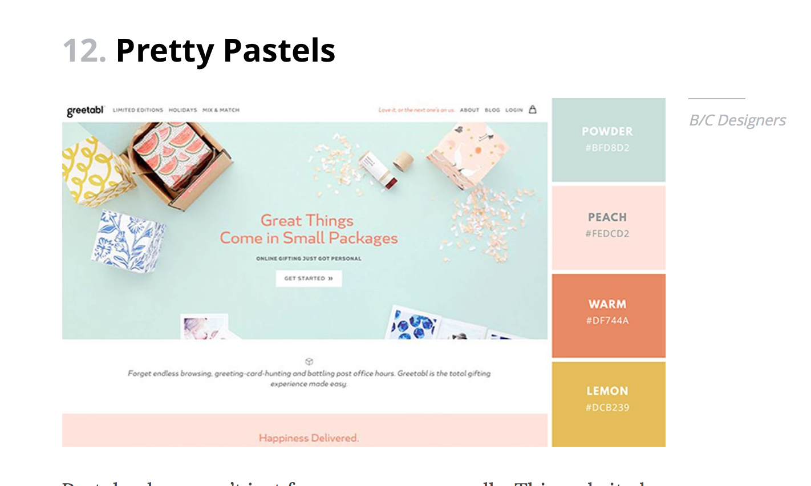
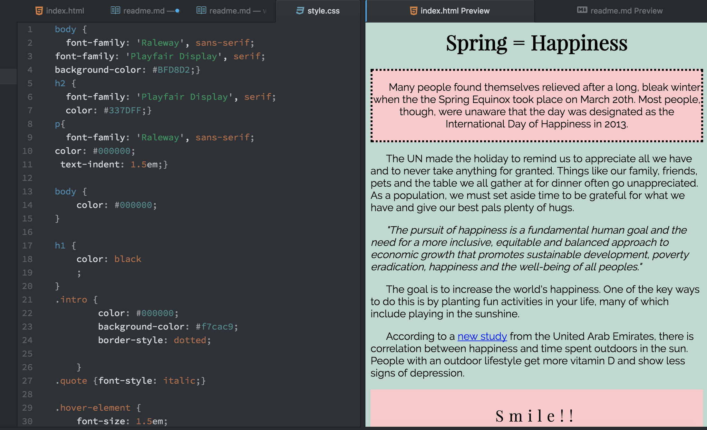

Kate Cier

Nick Moles 50 

# Summary:
This week it took me a while to understand how exactly CSS linked to HTML.  After reading through the lesson plan and the Duckett, I was confused as to which elements I was supposed to write on the .css file and which to put directly on the HTML document.  After looking at the duckett referring to www.w3schools.com, I was able to copy and paste their examples on a document just to experiement to see what did what.  I found it very interesting to read and look at all the websites that were posted as examples for complimentary text and color usage. There were so many options on the google text page that it took me forever just to decide which I was going to use on my assignment.

## Homework:
The hardest part of the homework for me this week was starting the assignment.  I was unsure if there had to be a head element on the .css file like there is on an HMTL document.
* I posted on the homework forum and asked if it was necessary to create both a style.css

Once I figured out that you could use the DIV element to make different portions of the text different than the parent settings, things went better and I was able to make different elements of my page stick out.

I decided to make my page about Spring and its correlation with happiness- a news story only because we just had the Spring Equinox.  This allowed me to pick colors from a spring pallette.  I ended up using light pastels that I chose from http://htmlcolorcodes.com.  I decided that it was easier to use the HEX codes.

I used this example to base my colors off of:

I chose not use the kerning element or element in my tags because teh indent element I used on the initial body statement was enough to make the paragraphs organized and uniform.

## Take Away:
These past two weeks have been super frustrating but now that I am more familiar with the link between CSS and HTML I am enjoying the freedom to makes things LOOK cool on a web page.  I used the HOVER element in my homework and think it is really cool that you can code something that the user can interact with.  I am looking forward to lerning about even more CSS elements that will make a website look more professional and elegant than my first one!

