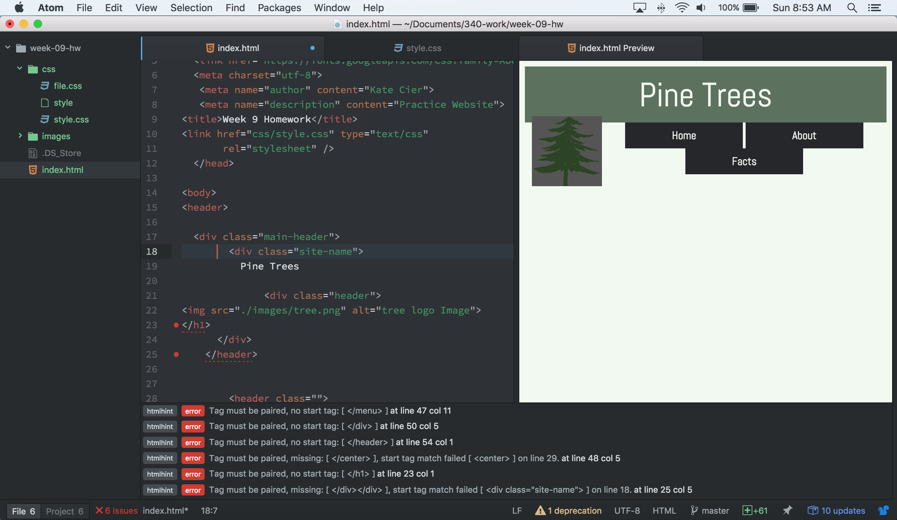
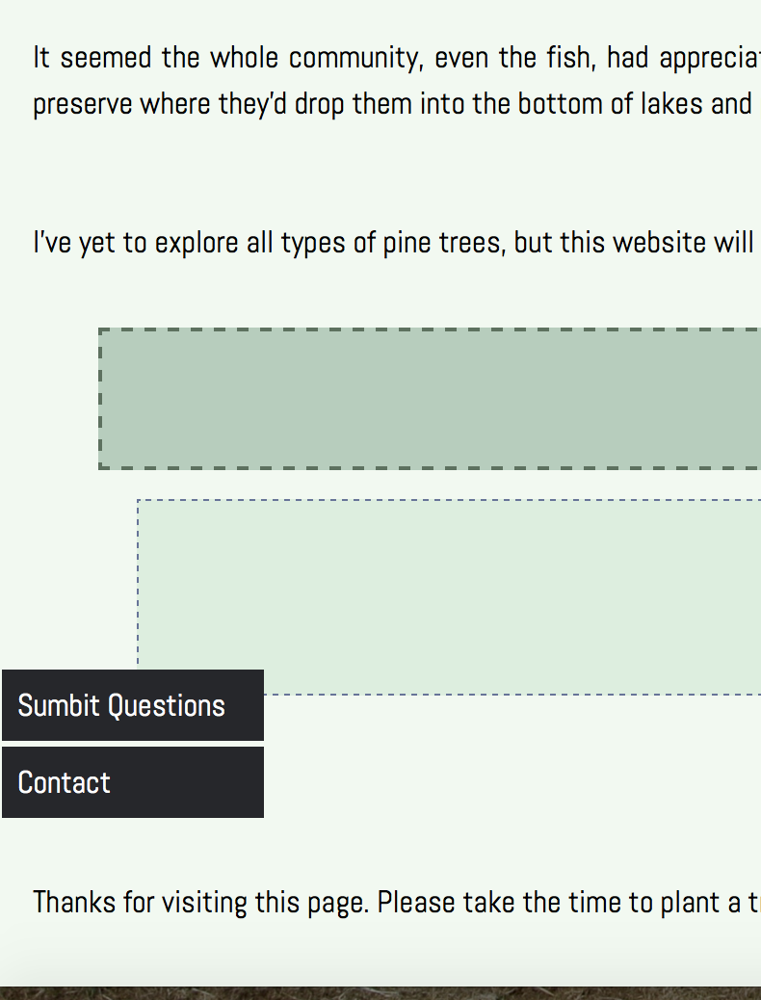

Kate Cier

 Nick Moles 50 

# Summary:
This week's work was a lot harder for me to grasp then last weeks.  I think that I am having trouble dealing with so many elements at once.  I started off by reading through all the slides, including the duckett- which wasn't etremely descriptive for this assignment.  After I read through all the sources, I began working on my homework.  My favorite part of this was the same as last week- I really enjoy picking out the complementary colors and fonts to create an aesthetically pleasing site.

## Homework:
What took me the longest on the homeowkr was trying to put the logo into the menu.  I wasn't able to put the image in my menu bar without moving the main text.

Things kept overlapping and I was very frustrated.  What I finally realized was that my main title and logo were not included in my .menu-container item so didn't have the green background.

I eventually worked with the margins a bit on the drop down menu to center them and put the whole thing together.

* I wasn't sure which order to put in the menu items on the .css sheet, so I ended up putting my sidebar at the bottom to give the page some variety.

I fiddled around with the z-index element to emphazise two main points at the bottom of my website and thought it was neat that the menu items were able to go over it.

I chose a green color theme from http://www.colorhunt.co/c/68238 which is a website that puts together cool HTML code colors.

## Take away:
This week was somewhat frustrating.  Overall, I think I just need to be more organized with my .css sheet so everything aligns properly. I also need to read some more on images to see how to properly insert them into the menu. 
