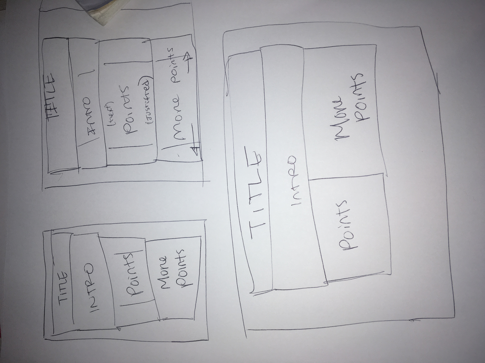
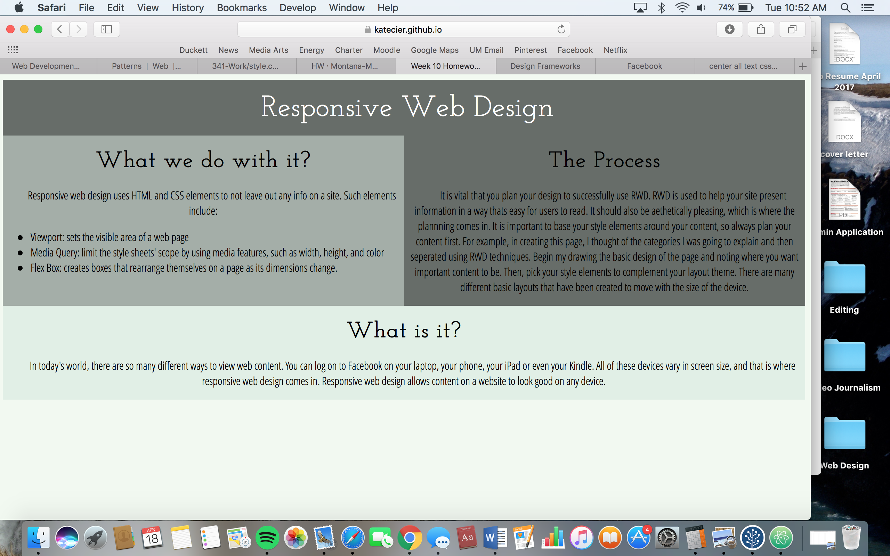

Kate Cier

Nick Moles 50

# Summary
I began the week by reading through the lesson and watching the videos.  I looked at Facebook and Pinterest to see how the displays would change when I adjusted the windows. The pixels and viewport lesson was confiuing until it was applied to writing the actual code where you simply have to use the <b>width=device-width</b> element. All the numbers, such as a device minimum viewport of 320px and fingers at 48px, are hard to keep track of.  After watching the videos, I found that the quizzes posted were really helpful- the breakpoint one let me visualize when the actual breakpoint occurs on the web.  The layout design concept was a bit confusing at first because I wasn't sure where things went on the .css page, because the example quizes showed him editing online.

## Homework
The homework itself was frustrating and took a lot of patience.  As usual, I enjoyed picking out my fonts and colors.  I wanted to keep my site as clear and basic as possible, so the .css document would be more clear.  I chose the Column Drop Layout because I figured it would be good for deliverying facts.  I planned out the content before I drew so I knew what I would need to fit.

* The content I chose to display was a 1. a basic intro to RWD 2. What we do with it and 3. The process of using it to create a webpage.
* The information that first draws the eye are the title and the introduction- I chose brighter colors and placed these at the top of the page.
* The primary content of the page was a very basic desprtion of what I'd taken away from the lesson on RWD so the beginning programmer could read it- sort of like the websites we read this week.
* The secondary content contains a list of definitions (viewport, media query, flexbox) within CSS so people can know what is being described.

I had some issues with making the order appear correctly as to not blend boxes and content:

I also thought I was finished with my site, then I checked it on my phone and had to adjust the breakpoints and the header.

## Take away:
This week was quite frustrating but I once I was able to figure out some key breakpoints, it was a little simpler.  The resources online were very helful, although it was hard to visualize the web content moving from screen to screen.  I did enjoy the aesthetic side of the project, and making everything compliment each other. 
