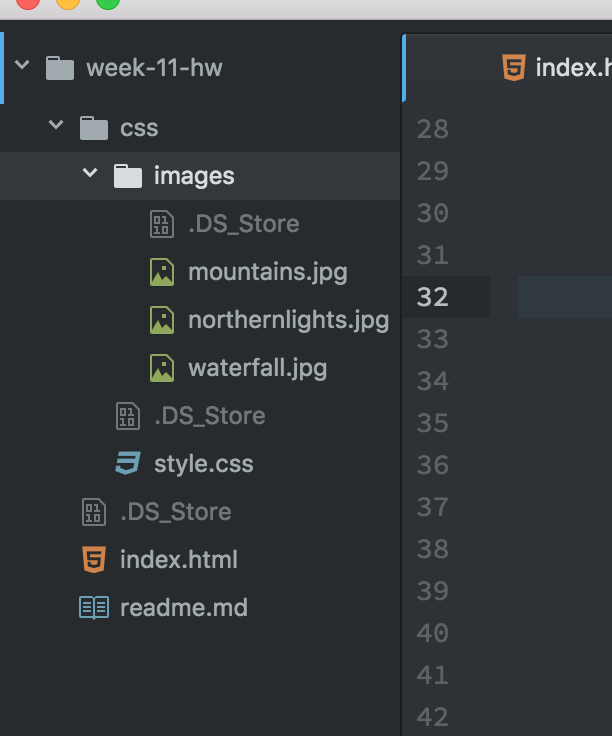

Kate Cier

Nick Moles 50

# Summary:
Reading about images helped clear some questions that I had over the past two weeks- especially when dealing with a logo inside of a container.  The infromation in the Duckett about images made it easier to format images so they wouldn't mess with the text inside a box.  One thing I noticed is that web design has a lot of different types of measurments to deal with, like viewport units (vh).  Hero images got me thinking about my final project because I really like the way they look and work to complement text on a webpage.  Parallex scrolling is a super cool feature but a bit conufisng to work with.  I enjoy the process and design part the lesson mentioned because I like planning colors, fonts and styles that will look good with each other.  This part it vital, too, if you want your website to come out the way you pictured.  The key point I took away was that content drives design. The https://www.awwwards.com link gave me some ideas on simple web design.

## Homework
I chose to make my page about traveling in Iceland because I had good quality pictures that I thought would work great as background pictures and not distract from the content.  I chose to make the border arounf my text red to make it stick out from the grey shades in the landscapes.

* I had an issue viewing my photos on my HTML document, but it turns out my photos were in a seperate folder than my css stylesheet.

The RWD principles were easier to apply this week, since I just had to specify them at the end instead of designing the entire page around them.

## Take away:
Overall, the concepts from this week were not hard to grasp.  I will definitely use the parallax element in my final project, as well as the hero element because they look professional, smooth and display images without distraction.  The w3schools was very helpful this week because it gave examples on why parallax is used in the first place. 
